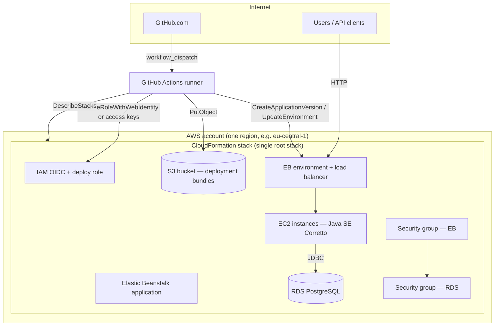
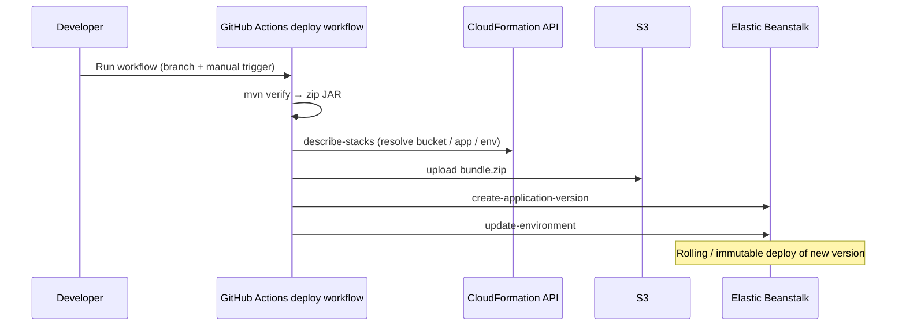

# Task Management API

A **Spring Boot 3** reference implementation: REST API for tasks, layered architecture, validation, JPA with **H2** (local) and **PostgreSQL** (production), **JUnit 5** / **Mockito**, **Docker**, **GitHub Actions** CI, and **AWS** delivery via **Terraform**, **CloudFormation**, **Elastic Beanstalk**, and **RDS**.

This document is written for **engineering teams** who need to understand **how it is built**, **how to run and test it**, and **how AWS is wired**. Deeper Terraform steps and GitHub variable setup are in [`terraform/README.md`](terraform/README.md) and [`.github/DEPLOY_AWS_SETUP.md`](.github/DEPLOY_AWS_SETUP.md).

---

## Table of contents

1. [Executive summary](#executive-summary)
2. [Architecture (diagrams)](#architecture-diagrams)
3. [Repository layout](#repository-layout)
4. [Application behavior](#application-behavior)
5. [Implementation: AWS infrastructure](#implementation-aws-infrastructure)
6. [CI/CD](#cicd)
7. [How to test](#how-to-test)
8. [Run locally](#run-locally)
9. [Docker](#docker)
10. [Troubleshooting pointers](#troubleshooting-pointers)
11. [Further reading](#further-reading)

---

## Executive summary

| Concern | Approach |
|--------|----------|
| **API** | Spring Web, `/tasks` CRUD; `GET /deploy-check` for post-deploy smoke tests |
| **Data** | H2 in-memory for local dev; PostgreSQL on **RDS** when `SPRING_PROFILES_ACTIVE=production` (Elastic Beanstalk) |
| **Infrastructure** | **Terraform** applies a single **CloudFormation** stack so resources stay visible in the AWS console (events, outputs, rollback) |
| **Deploy artifact** | Maven builds `target/application.jar`; GitHub Actions zips it and pushes to **S3**, then registers an EB **application version** and **updates the environment** |
| **GitHub → AWS auth** | **OIDC → IAM role** (recommended) or **IAM user access keys** (static); see [`.github/DEPLOY_AWS_SETUP.md`](.github/DEPLOY_AWS_SETUP.md) |
| **CI** | On every push/PR to `main` or `master`: `mvn -B verify` + Docker image build |
| **CD** | **Manual only** — **Actions → Deploy to AWS (Elastic Beanstalk) → Run workflow** |

---

## Architecture (diagrams)

### High-level AWS topology

Terraform targets the **default VPC** (typical for demos / small footprints). The stack creates security groups so **only EB instances** reach **RDS** on PostgreSQL; the load balancer exposes HTTP to clients.



### Deploy pipeline (conceptual)

Infrastructure **provisioning** (Terraform / CloudFormation) is separate from **application releases** (GitHub Actions). The diagram below is the **release** path after the stack exists.



---

## Repository layout

```
.
├── Dockerfile
├── Procfile                         # EB: web process → java -jar application.jar
├── docker-compose.yml
├── pom.xml
├── scripts/
│   └── upload-eb-bundle.sh          # Zip JAR → S3 (before/after EB enable; see terraform README)
├── terraform/
│   ├── cloudformation/
│   │   └── task-management.yaml   # Single template: RDS, S3, EB, SGs, optional GitHub OIDC
│   ├── cfn_stack.tf               # aws_cloudformation_stack + parameters
│   ├── variables.tf
│   └── README.md                  # apply order, outputs, destroy
├── .github/
│   ├── workflows/
│   │   ├── ci.yml                 # PR/main: mvn verify + docker build
│   │   └── deploy-aws.yml         # Manual: build → S3 → EB version → update env
│   └── DEPLOY_AWS_SETUP.md        # Secrets, variables, OIDC vs static keys
└── src/main/java/com/example/taskmanagement/
    ├── TaskManagementApplication.java
    ├── controller/                # REST + deploy smoke endpoint
    ├── service/
    ├── repository/
    ├── model/
    ├── dto/
    └── exception/
```

---

## Application behavior

### Tech stack

| Area | Choice |
|------|--------|
| Language | Java 21 |
| Framework | Spring Boot 3.4 |
| Build | Maven (`finalName`: `application.jar`) |
| Persistence | Spring Data JPA — H2 (local), PostgreSQL (production) |
| Utilities | Lombok (annotation processing configured in `pom.xml`) |
| Tests | JUnit 5, Mockito, AssertJ |

### Spring profiles

| Profile | Use | Data store |
|--------|-----|------------|
| `local` (default) | `mvn spring-boot:run` | H2 in-memory, `/h2-console` enabled |
| `production` | Elastic Beanstalk env vars | RDS PostgreSQL (`SPRING_DATASOURCE_*`) |

Elastic Beanstalk sets `SPRING_PROFILES_ACTIVE=production`, `PORT`, and JDBC settings via the CloudFormation template.

### HTTP API

Base path for tasks: **`/tasks`** (port **8080** locally, or `PORT` on EB).

| Method | Path | Description |
|--------|------|-------------|
| `GET` | `/tasks` | List tasks |
| `GET` | `/tasks/{id}` | Get by id |
| `POST` | `/tasks` | Create (JSON body) |
| `PUT` | `/tasks/{id}` | Update |
| `DELETE` | `/tasks/{id}` | Delete |
| `GET` | `/deploy-check` | Plain-text smoke marker after deploy (see [How to test](#how-to-test)) |

Example create body:

```json
{
  "title": "Ship feature",
  "description": "API + tests",
  "status": "TODO"
}
```

---

## Implementation: AWS infrastructure

### Terraform and CloudFormation

- **Terraform** owns **one** resource: `aws_cloudformation_stack` pointing at [`terraform/cloudformation/task-management.yaml`](terraform/cloudformation/task-management.yaml).
- **Why both?** Terraform is convenient for variables, state, and wiring; **CloudFormation** gives a **single stack** in the console with **Events**, **Resources**, **Outputs**, and clear **rollback** behavior.

### What the stack creates (logical components)

| Component | Purpose |
|-----------|---------|
| **VPC wiring** | Uses **default VPC** + subnets from Terraform data sources; passes IDs into the template |
| **Security groups** | EB instances: HTTP from VPC CIDR; RDS: PostgreSQL **only** from EB security group |
| **RDS** | PostgreSQL (size/class via Terraform variables) |
| **S3 bucket** | Stores `releases/<label>.zip` bundles for the initial EB application version and for manual uploads |
| **Elastic Beanstalk** | Application + (when enabled) environment on **Java SE Corretto 21** solution stack — **not** Tomcat (see `eb_solution_stack_name_regex` in Terraform) |
| **IAM** | Instance profile for EC2; optional **GitHub OIDC provider + role** for Actions to deploy without long-lived keys |
| **Outputs** | Bucket name, EB names, RDS endpoint, OIDC role ARN — consumed by Terraform outputs and optionally by GitHub via `describe-stacks` |

### Two-phase provisioning (important)

1. **Phase 1 — `deploy_eb_environment = false`**  
   Creates RDS, S3, EB *application*, IAM, optional OIDC — **no** EB environment yet (no bundle required in S3 for the first CloudFormation EB resources path).

2. **Build & upload**  
   `mvn package` then [`scripts/upload-eb-bundle.sh`](scripts/upload-eb-bundle.sh) `<label>` (must match `eb_version_label` in `terraform.tfvars`).

3. **Phase 2 — `deploy_eb_environment = true`**  
   `terraform apply` updates the stack so CloudFormation creates the **application version** (from S3) and the **EB environment**.

After that, day-to-day **code releases** use **GitHub Actions** (`deploy-aws.yml`), which uploads a **new** zip per commit SHA and updates the environment — **without** re-running Terraform for each release.

### Resolve deploy targets in GitHub

The deploy workflow can read **`CLOUDFORMATION_STACK_NAME`** and call **`cloudformation:DescribeStacks`** to obtain bucket, EB application, and environment names from **stack outputs** (recommended). Alternatively, set individual **`EB_*`** repository variables. Details: [`.github/DEPLOY_AWS_SETUP.md`](.github/DEPLOY_AWS_SETUP.md).

---

## CI/CD

### Continuous integration — [`.github/workflows/ci.yml`](.github/workflows/ci.yml)

| Trigger | Branches |
|---------|----------|
| `push`, `pull_request` | `main`, `master` |

Steps: checkout → JDK 21 (Temurin) + Maven cache → **`mvn -B verify`** → **`docker build`**.  
No deployment to AWS in this workflow.

### Continuous deployment — [`.github/workflows/deploy-aws.yml`](.github/workflows/deploy-aws.yml)

| Trigger | Notes |
|---------|--------|
| **`workflow_dispatch` only** | **Actions → Deploy to AWS (Elastic Beanstalk) → Run workflow** (pick branch) |

Steps (simplified): resolve AWS auth (OIDC vs static keys) → **`mvn -B verify`** → resolve bucket/app/env (CloudFormation outputs and/or variables) → zip JAR → **`aws s3 cp`** → **`create-application-version`** → **`update-environment`**.

Configure repository **secrets** and **variables** as documented in [`.github/DEPLOY_AWS_SETUP.md`](.github/DEPLOY_AWS_SETUP.md).

---

## How to test

### Automated tests (local / CI)

```bash
mvn -B verify
```

Runs unit tests (e.g. service layer with Mockito) and produces `target/application.jar`.

### Manual API checks (local)

```bash
mvn spring-boot:run
# optional: curl against http://localhost:8080/tasks
```

### Smoke test after AWS deploy

1. From Terraform output or CloudFormation **Outputs**, note the EB environment CNAME (load balancer DNS).
2. Open **`http://<cname>/deploy-check`** — expect a short string including the deploy marker (e.g. `deploy-check gha-smoke-1`).
3. **`GET /tasks`** should return `200` (possibly `[]` if empty).
4. In **Elastic Beanstalk → Logs** (or **CloudWatch** log groups), search for **`deploy_check version=`** after a new version rolls out.

### Docker

After `mvn -B verify`:

```bash
docker build -t task-management:local .
docker run --rm -p 8080:8080 task-management:local
```

Compose (app + PostgreSQL) is available via `docker compose up --build` once the JAR exists; see comments in [`docker-compose.yml`](docker-compose.yml).

---

## Run locally

### H2 (default)

```bash
mvn spring-boot:run
```

H2 console: `http://localhost:8080/h2-console` — JDBC URL `jdbc:h2:mem:taskdb`, user `sa`, empty password.

### PostgreSQL locally

```bash
export SPRING_PROFILES_ACTIVE=production
export SPRING_DATASOURCE_URL=jdbc:postgresql://localhost:5432/taskdb
export SPRING_DATASOURCE_USERNAME=postgres
export SPRING_DATASOURCE_PASSWORD=postgres
mvn spring-boot:run
```

---

## Docker

The `Dockerfile` expects `target/application.jar`. Typical flow:

```bash
mvn -B verify
docker build -t task-management:local .
docker run --rm -p 8080:8080 \
  -e SPRING_PROFILES_ACTIVE=production \
  -e SPRING_DATASOURCE_URL=jdbc:postgresql://host.docker.internal:5432/taskdb \
  -e SPRING_DATASOURCE_USERNAME=postgres \
  -e SPRING_DATASOURCE_PASSWORD=postgres \
  task-management:local
```

---

## Troubleshooting pointers

| Symptom | Where to look |
|---------|----------------|
| Terraform / stack failures | **CloudFormation** console → stack → **Events** |
| EB environment unhealthy | EB **Logs**; verify `SPRING_DATASOURCE_*`, `PORT`, security groups RDS ↔ EB |
| GitHub deploy cannot resolve bucket/app/env | Repository variable **`CLOUDFORMATION_STACK_NAME`**; IAM needs **`cloudformation:DescribeStacks`** |
| Missing EB environment in outputs | Stack may still be **phase 1** — upload bundle and set **`deploy_eb_environment = true`**, then `terraform apply` ([`terraform/README.md`](terraform/README.md)) |
| Wrong Java platform (e.g. Tomcat vs JAR) | Terraform **`eb_solution_stack_override`** or regex **`eb_solution_stack_name_regex`** |

---

## Further reading

| Document | Content |
|----------|---------|
| [`terraform/README.md`](terraform/README.md) | `terraform init` / `apply`, two-phase EB, outputs, destroy, free-tier notes |
| [`.github/DEPLOY_AWS_SETUP.md`](.github/DEPLOY_AWS_SETUP.md) | GitHub **secrets** vs **variables**, OIDC vs static IAM user |
| [`terraform/cloudformation/task-management.yaml`](terraform/cloudformation/task-management.yaml) | Full AWS resource list and parameters |

---

## License

Showcase / portfolio — add a license if you redistribute.
